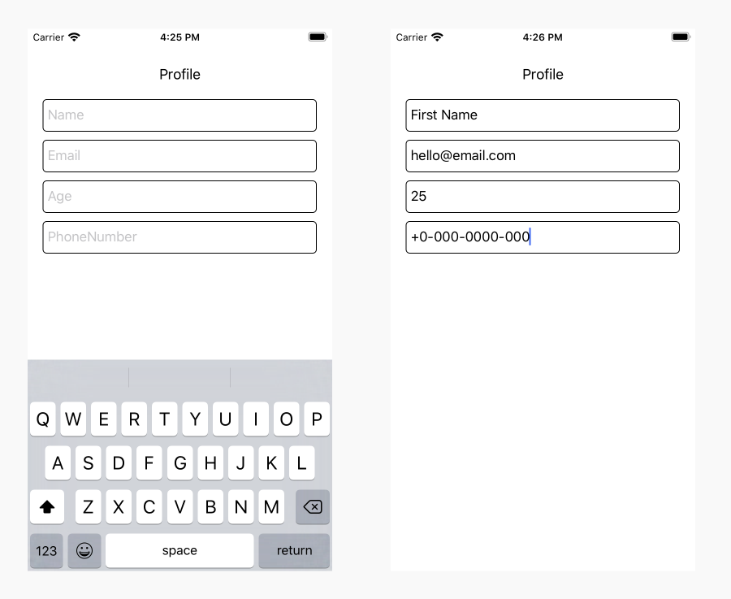

# React Native - Input Class

A React Native based component for creating Input Class in your application. 

## Getting started

- [Demo](#demo)
- [Installation](#installation)
- [Supported versions](#supported-versions)
- [Usage](#usage)
- [Props](#props)
- [Methods](#methods)
- [Want to Contribute?](#want-to-contribute?)
- [Collection of Components](#collection-of-components)
- [Changelog](#changelog)
- [License](#license)
- [Keywords](#keywords)

## Demo

[](https://github.com/weblineindia/React-Native-Input-Class/InputClass.png)

## Installation

`$ npm install rn-weblineindia-input-class --save`

## Supported versions

We have tested this component in ReactNative 0.60 - 0.62.5. You can still use it in other versions.

## Usage

```javascript
import InputClass from 'rn-weblineindia-input-class';

<InputClass
  placeholder="Email"
  type="Email"
  value={email}
  onChangeText={(text) => this.setState({ email: text })}
  keyboardType="email-address"
  onEndError={(status) => this.onEndError(status)}
/>

```

## Props

| **Props**            | **Type** | **Required** | **Description**                                                               |
|----------------------|----------|--------------|-------------------------------------------------------------------------------|
| type                 | `string` | yes          | Type of input class like, Text, Email, Number, PhoneNumber                    |
| value                | `string` | yes          | Value to be shown in input class                                              |
| secureTextEntry      | `boolean`| no           | Set true when you want password, encrypted content                            |
| keyboardType         | `string` | no           | Keyboard type like, email-address, number, phone-number, default              |
| style                | `object` | yes          | Style object to set style to input class                                      |
| placeholder          | `string` | no           | Placeholder text which is shown when to instruct user about input class       |


## Methods

| **Method**           | **Description**                                                                                                                          |
|----------------------|------------------------------------------------------------------------------------------------------------------------------------------|
| onChangeText         | Callback method that is called when user change text on Input Class.                                                                     |
| onEndError           | Callback method that is called when user end editing and validation will be check and give call back to InputClass Wrong Email Format.   |


## Want to Contribute?

- Created something awesome, made this code better, added some functionality, or whatever (this is the hardest part).
- [Fork it](http://help.github.com/forking/).
- Create new branch to contribute your changes.
- Commit all your changes to your branch.
- Submit a [pull request](http://help.github.com/pull-requests/).

-----

## Collection of Components

We have built many other components and free resources for software development in various programming languages. Kindly click here to view our [Free Resources for Software Development](https://www.weblineindia.com/software-development-resources.html).

------

## Changelog

Detailed changes for each release are documented in [CHANGELOG.md](./CHANGELOG.md).

------

## License

[MIT](LICENSE)

[mit]: https://github.com/weblineindia/React-Native-Input-Class/blob/master/LICENSE

------

### Keywords

 rn-weblineindia-input-class, react-native-input-class, input-class, react-native
